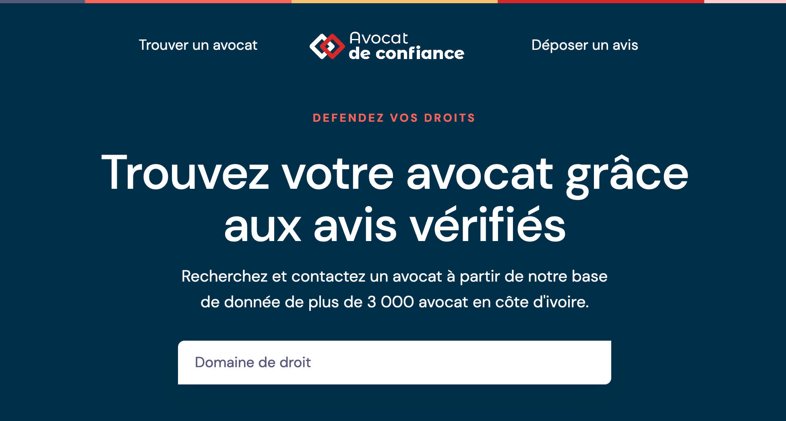

## Avocat de confiance



Recherchez et contactez un avocat à partir de notre base de donnée de plus de 3 000 avocat en côte d'ivoire. 
#### Environement technique
- [Angular](https://angular.io/), 
- [Bootstrap 5](https://getbootstrap.com/) 
- [PrimeNg](https://primefaces.org/primeng/)

#### Principe du projet

- [x] Une interface simple
- [x] Application web responsive
- [x] Rechercher un avocat
- [ ] Voir la liste des avocats
- [ ] Déposer un avis

### Installation
Pour exécuter le projet, saisissez les commandes suivantes :
``` 
$ git clone https://github.com/agazinakou/avocatdeconfiance.git
$ cd avocatdeconfiance
$ npm install 
```

This will install all dependencies required to run the node app.

#### Serveur de développement
Exécutez `ng serve` pour un serveur de développement. Accédez à `http://localhost:4200/`. L'application se rechargera automatiquement si vous modifiez l'un des fichiers source.

### Aide
Si vous avez besoin d'un support technique ou avez des questions, veuillez envoyer un message à agazinakou@gmail.com ou via skype : aziiin5
